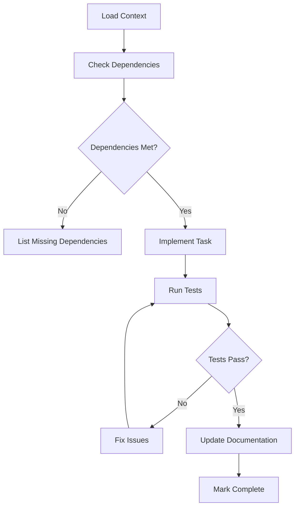

# /spec-execute

Execute a specific task from a feature specification.

## Usage
```
/spec-execute [task-number] [feature-name]
```

## Example
```
/spec-execute 1 online-reservations
```

## Process

1. **Load Full Context**
   - Load steering documents for project standards
   - Load feature specification (requirements + design)
   - Load specific task details
   - Understand dependencies

2. **Validate Prerequisites**
   - Check if dependent tasks are complete
   - Verify required services are available
   - Ensure test environment is ready

3. **Implement Task**
   - Follow coding standards from tech.md
   - Use patterns from structure.md
   - Implement according to design specification
   - Write necessary tests

4. **Quality Checks**
   - Run linters and formatters
   - Execute unit tests
   - Check type safety
   - Validate against requirements

5. **Update Documentation**
   - Mark task as complete in tasks.md
   - Update any affected documentation
   - Add code comments where needed

## Task Execution Flow



## Available Commands

During task execution, you can use:
- `/spec-status` - Check current progress
- `/spec-dependencies` - View task dependencies
- `/spec-rollback` - Revert changes if needed
- `/spec-test` - Run tests for current task

## Error Handling

If execution fails:
1. Error details are logged
2. Partial changes are identified
3. Rollback plan is suggested
4. Fix recommendations provided

## Success Indicators

✅ Code implements specification
✅ All tests pass
✅ No linting errors
✅ Documentation updated
✅ Task marked complete