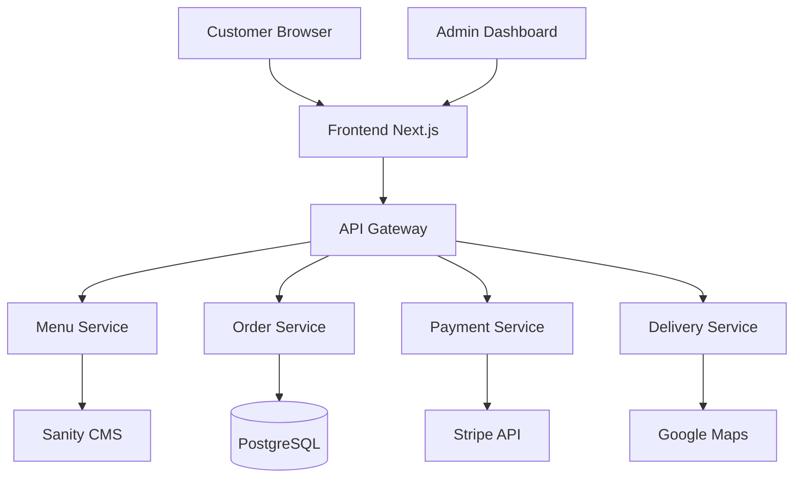
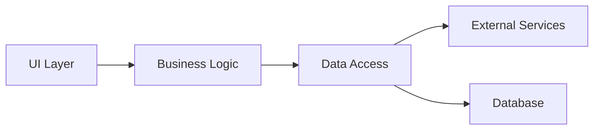
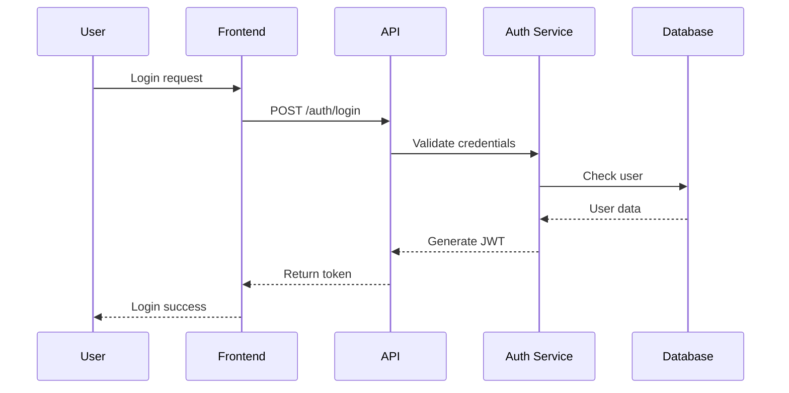

# Design Specification - [FEATURE_NAME]

## 🏗️ Architecture Overview

### System Context


### Component Architecture


## 🔧 Technical Design

### Frontend Architecture

#### Component Structure
```typescript
// Component hierarchy
<FeatureContainer>
  <FeatureHeader />
  <FeatureContent>
    <DataDisplay />
    <UserActions />
  </FeatureContent>
  <FeatureFooter />
</FeatureContainer>
```

#### State Management
```typescript
// Store structure
interface FeatureState {
  data: {
    items: Item[];
    loading: boolean;
    error: Error | null;
  };
  ui: {
    selectedItem: string | null;
    filters: FilterOptions;
    sortOrder: SortOrder;
  };
  user: {
    preferences: UserPreferences;
    history: UserAction[];
  };
}
```

### Backend Architecture

#### Service Layer Design
```typescript
// Service interface
interface MenuService {
  // Query operations
  getMenuItems(filters?: MenuFilters): Promise<MenuItem[]>;
  getItemById(id: string): Promise<MenuItem>;
  searchItems(query: string): Promise<MenuItem[]>;
  
  // Command operations
  updateAvailability(id: string, available: boolean): Promise<void>;
  updatePrice(id: string, price: number): Promise<void>;
  
  // Business operations
  checkItemAvailability(id: string): Promise<boolean>;
  calculatePreparationTime(items: string[]): Promise<number>;
}
```

#### API Design
```yaml
# RESTful API Endpoints
/api/v1/menu:
  GET:
    description: Get menu items
    parameters:
      - category: string
      - dietary: string[]
      - spiceLevel: number
      - available: boolean
    response:
      200: MenuItem[]
      400: ValidationError
      500: ServerError

  POST:
    description: Create menu item (admin)
    body: CreateMenuItemDto
    response:
      201: MenuItem
      400: ValidationError
      401: Unauthorized
      500: ServerError

/api/v1/menu/{id}:
  GET:
    description: Get specific menu item
    response:
      200: MenuItem
      404: NotFound
      500: ServerError

  PUT:
    description: Update menu item (admin)
    body: UpdateMenuItemDto
    response:
      200: MenuItem
      400: ValidationError
      401: Unauthorized
      404: NotFound
      500: ServerError
```

## 📊 Data Models

### Database Schema
```sql
-- Menu Items Table
CREATE TABLE menu_items (
    id UUID PRIMARY KEY DEFAULT gen_random_uuid(),
    name VARCHAR(255) NOT NULL,
    name_hindi VARCHAR(255),
    description TEXT,
    category_id UUID REFERENCES categories(id),
    price DECIMAL(10, 2) NOT NULL,
    currency VARCHAR(3) DEFAULT 'INR',
    spice_level INTEGER CHECK (spice_level BETWEEN 1 AND 4),
    is_vegetarian BOOLEAN DEFAULT false,
    is_vegan BOOLEAN DEFAULT false,
    is_gluten_free BOOLEAN DEFAULT false,
    preparation_time INTEGER, -- in minutes
    is_available BOOLEAN DEFAULT true,
    image_url TEXT,
    created_at TIMESTAMP DEFAULT CURRENT_TIMESTAMP,
    updated_at TIMESTAMP DEFAULT CURRENT_TIMESTAMP
);

-- Categories Table
CREATE TABLE categories (
    id UUID PRIMARY KEY DEFAULT gen_random_uuid(),
    name VARCHAR(100) NOT NULL,
    display_order INTEGER,
    icon VARCHAR(50),
    is_active BOOLEAN DEFAULT true
);

-- Orders Table
CREATE TABLE orders (
    id UUID PRIMARY KEY DEFAULT gen_random_uuid(),
    order_number VARCHAR(20) UNIQUE NOT NULL,
    customer_id UUID REFERENCES customers(id),
    status VARCHAR(50) NOT NULL,
    service_type VARCHAR(50) NOT NULL, -- dine-in, takeaway, delivery
    total_amount DECIMAL(10, 2) NOT NULL,
    tax_amount DECIMAL(10, 2),
    delivery_fee DECIMAL(10, 2),
    special_instructions TEXT,
    created_at TIMESTAMP DEFAULT CURRENT_TIMESTAMP,
    updated_at TIMESTAMP DEFAULT CURRENT_TIMESTAMP
);

-- Order Items Table
CREATE TABLE order_items (
    id UUID PRIMARY KEY DEFAULT gen_random_uuid(),
    order_id UUID REFERENCES orders(id),
    menu_item_id UUID REFERENCES menu_items(id),
    quantity INTEGER NOT NULL,
    unit_price DECIMAL(10, 2) NOT NULL,
    customizations JSONB,
    notes TEXT
);
```

### TypeScript Interfaces
```typescript
// Domain models
interface MenuItem {
  id: string;
  name: string;
  nameHindi?: string;
  description: string;
  category: Category;
  price: Money;
  spiceLevel: SpiceLevel;
  dietary: DietaryInfo;
  availability: AvailabilityStatus;
  preparationTime: number;
  images: Image[];
  nutritionalInfo?: NutritionalInfo;
  allergens: Allergen[];
}

interface Order {
  id: string;
  orderNumber: string;
  customer: Customer;
  items: OrderItem[];
  status: OrderStatus;
  serviceType: ServiceType;
  payment: PaymentInfo;
  delivery?: DeliveryInfo;
  totals: OrderTotals;
  timestamps: OrderTimestamps;
}

interface OrderItem {
  menuItem: MenuItem;
  quantity: number;
  customizations: Customization[];
  specialInstructions?: string;
  price: Money;
}

// Enums
enum SpiceLevel {
  MILD = 1,
  MEDIUM = 2,
  HOT = 3,
  EXTRA_HOT = 4
}

enum OrderStatus {
  PENDING = 'PENDING',
  CONFIRMED = 'CONFIRMED',
  PREPARING = 'PREPARING',
  READY = 'READY',
  OUT_FOR_DELIVERY = 'OUT_FOR_DELIVERY',
  DELIVERED = 'DELIVERED',
  CANCELLED = 'CANCELLED'
}

enum ServiceType {
  DINE_IN = 'DINE_IN',
  TAKEAWAY = 'TAKEAWAY',
  DELIVERY = 'DELIVERY',
  CATERING = 'CATERING'
}
```

## 🔄 Integration Points

### External Services

#### Payment Integration (Stripe)
```typescript
// Payment service integration
class StripePaymentService implements PaymentService {
  async createPaymentIntent(amount: Money): Promise<PaymentIntent> {
    return stripe.paymentIntents.create({
      amount: amount.toCents(),
      currency: amount.currency,
      metadata: { source: 'restaurant-app' }
    });
  }
  
  async confirmPayment(paymentIntentId: string): Promise<Payment> {
    // Implementation
  }
  
  async refundPayment(paymentId: string, amount?: Money): Promise<Refund> {
    // Implementation
  }
}
```

#### CMS Integration (Sanity)
```typescript
// Sanity CMS integration
class SanityMenuService {
  async syncMenuItems(): Promise<void> {
    const items = await sanityClient.fetch(`
      *[_type == "menuItem"] {
        _id,
        name,
        description,
        price,
        category->,
        "imageUrl": image.asset->url
      }
    `);
    
    // Sync with database
    await this.updateLocalMenu(items);
  }
}
```

## 🎨 UI/UX Design

### Component Specifications

#### Menu Item Card
```jsx
<MenuItemCard>
  <Image src={item.imageUrl} alt={item.name} />
  <Content>
    <Title>{item.name}</Title>
    <Description>{item.description}</Description>
    <Tags>
      <SpiceIndicator level={item.spiceLevel} />
      <DietaryBadges dietary={item.dietary} />
    </Tags>
    <Footer>
      <Price>{formatPrice(item.price)}</Price>
      <AddToCartButton onClick={() => addToCart(item)} />
    </Footer>
  </Content>
</MenuItemCard>
```

### Design Tokens
```scss
// Colors
$primary-brown: #8B4513;
$forest-green: #228B22;
$mustard-yellow: #FFDB58;
$accent-saffron: #F4A460;
$accent-turmeric: #E3B505;
$accent-chili: #C21807;

// Typography
$font-family-primary: 'Inter', sans-serif;
$font-family-secondary: 'Playfair Display', serif;

// Spacing
$spacing-xs: 4px;
$spacing-sm: 8px;
$spacing-md: 16px;
$spacing-lg: 24px;
$spacing-xl: 32px;

// Breakpoints
$breakpoint-mobile: 640px;
$breakpoint-tablet: 768px;
$breakpoint-desktop: 1024px;
$breakpoint-wide: 1280px;
```

## 🔐 Security Design

### Authentication Flow


### Authorization Rules
```typescript
// Role-based access control
const permissions = {
  customer: {
    menu: ['read'],
    orders: ['read:own', 'create:own'],
    profile: ['read:own', 'update:own']
  },
  staff: {
    menu: ['read', 'update:availability'],
    orders: ['read', 'update:status'],
    kitchen: ['read', 'update']
  },
  admin: {
    menu: ['*'],
    orders: ['*'],
    users: ['*'],
    analytics: ['*']
  }
};
```

## 🚀 Performance Optimization

### Caching Strategy
```yaml
Cache Layers:
  CDN:
    - Static assets (images, CSS, JS)
    - TTL: 1 year with versioning
    
  Application Cache:
    - Menu data: 5 minutes
    - User sessions: 24 hours
    - API responses: 60 seconds
    
  Database Cache:
    - Query results: 30 seconds
    - Prepared statements
    
  Browser Cache:
    - Service worker for offline
    - LocalStorage for preferences
```

### Query Optimization
```sql
-- Optimized menu query with indexes
CREATE INDEX idx_menu_items_category ON menu_items(category_id);
CREATE INDEX idx_menu_items_availability ON menu_items(is_available);
CREATE INDEX idx_menu_items_dietary ON menu_items(is_vegetarian, is_vegan);

-- Materialized view for popular items
CREATE MATERIALIZED VIEW popular_items AS
SELECT 
    mi.*,
    COUNT(oi.id) as order_count
FROM menu_items mi
LEFT JOIN order_items oi ON mi.id = oi.menu_item_id
WHERE oi.created_at > NOW() - INTERVAL '7 days'
GROUP BY mi.id
ORDER BY order_count DESC
LIMIT 10;
```

## 📱 Responsive Design

### Breakpoint Strategy
```css
/* Mobile First Approach */
.menu-grid {
  display: grid;
  grid-template-columns: 1fr;
  gap: 1rem;
}

/* Tablet */
@media (min-width: 768px) {
  .menu-grid {
    grid-template-columns: repeat(2, 1fr);
  }
}

/* Desktop */
@media (min-width: 1024px) {
  .menu-grid {
    grid-template-columns: repeat(3, 1fr);
  }
}

/* Wide Screen */
@media (min-width: 1280px) {
  .menu-grid {
    grid-template-columns: repeat(4, 1fr);
  }
}
```

## 🧪 Testing Strategy

### Test Coverage Plan
```javascript
// Unit test example
describe('MenuService', () => {
  describe('getMenuItems', () => {
    it('should return filtered menu items', async () => {
      const filters = { category: 'appetizers', isVegetarian: true };
      const items = await menuService.getMenuItems(filters);
      
      expect(items).toBeArray();
      expect(items.every(item => item.category === 'appetizers')).toBe(true);
      expect(items.every(item => item.isVegetarian)).toBe(true);
    });
    
    it('should handle empty results', async () => {
      const filters = { category: 'non-existent' };
      const items = await menuService.getMenuItems(filters);
      
      expect(items).toEqual([]);
    });
  });
});
```

## 📈 Monitoring & Logging

### Logging Strategy
```typescript
// Structured logging
interface LogEntry {
  timestamp: Date;
  level: 'debug' | 'info' | 'warn' | 'error';
  service: string;
  action: string;
  userId?: string;
  metadata?: Record<string, any>;
}

// Example usage
logger.info({
  service: 'OrderService',
  action: 'createOrder',
  userId: customer.id,
  metadata: {
    orderId: order.id,
    amount: order.total,
    items: order.items.length
  }
});
```

## 🚢 Deployment Architecture

### Infrastructure
```yaml
Production Environment:
  Frontend:
    - Vercel Edge Network
    - Auto-scaling
    - SSL/TLS
    
  Backend:
    - AWS ECS / Google Cloud Run
    - Load Balancer
    - Auto-scaling groups
    
  Database:
    - Supabase (PostgreSQL)
    - Read replicas
    - Automated backups
    
  Cache:
    - Redis cluster
    - CloudFlare CDN
    
  Monitoring:
    - Sentry for errors
    - New Relic for APM
    - CloudWatch for infrastructure
```