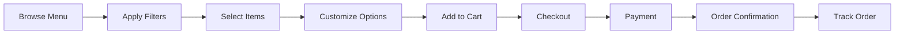
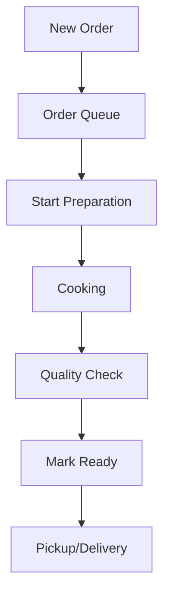

# 🍛 Indian Restaurant E-commerce Platform - Complete Context

## 🎯 Project Overview

An advanced digital platform for authentic Indian restaurant operations, combining traditional culinary excellence with modern e-commerce capabilities. Built with Next.js, TypeScript, and headless architecture for maximum flexibility and performance.

### Core Value Proposition
- **Authentic Indian Cuisine**: Regional dishes from across India
- **Modern Ordering System**: Seamless digital experience
- **Customizable Options**: Spice levels, portions, dietary preferences
- **Multi-Service Platform**: Dine-in, takeaway, delivery, catering

## 🏗️ Technical Architecture

### System Stack
```
Frontend:       Next.js 14+ (App Router), React 18+, TypeScript 5+
Styling:        Tailwind CSS 3+, CSS Modules
State:          Zustand/Redux Toolkit, React Query
CMS:            Sanity.io (Headless)
E-commerce:     Medusa.js v2
Database:       PostgreSQL (Supabase)
Payments:       Stripe, Razorpay
Hosting:        Vercel, AWS/GCP
Monitoring:     Sentry, Google Analytics
```

### Architecture Diagram
```
┌─────────────────────────────────────────────────────┐
│                 Customer Interface                   │
│         (Web Browser / Mobile Browser)              │
└─────────────────────┬───────────────────────────────┘
                      ↓
┌─────────────────────────────────────────────────────┐
│              Frontend Application                    │
│                  (Next.js)                          │
│  • Server Components  • Client Components           │
│  • App Router        • API Routes                   │
└─────────────────────┬───────────────────────────────┘
                      ↓
┌─────────────────────────────────────────────────────┐
│                  API Gateway                        │
│         (Next.js API Routes / GraphQL)             │
└────┬──────────┬──────────┬──────────┬──────────────┘
     ↓          ↓          ↓          ↓
┌────────┐ ┌────────┐ ┌────────┐ ┌────────┐
│Sanity  │ │Medusa  │ │Supabase│ │External│
│  CMS   │ │  .js   │ │   DB   │ │Services│
└────────┘ └────────┘ └────────┘ └────────┘
```

## 📁 Project Structure

```
restaurant-ecommerce/
├── .claude/                    # Claude Code workflows
│   ├── steering/              # Project context (product, tech, structure)
│   ├── templates/             # Spec and bug templates
│   ├── specs/                # Feature specifications
│   ├── commands/             # Slash commands
│   └── agents/               # AI agents
├── src/
│   ├── app/                  # Next.js app router
│   ├── components/           # React components
│   ├── features/            # Feature modules
│   ├── services/           # Business logic
│   ├── hooks/              # Custom hooks
│   ├── types/              # TypeScript types
│   └── styles/             # Global styles
├── public/                 # Static assets
├── tests/                  # Test suites
└── docs/                   # Documentation
```

## 🍽️ Domain Model

### Core Entities

#### MenuItem
```typescript
interface MenuItem {
  id: string;
  name: string;
  nameHindi?: string;
  description: string;
  category: Category;
  price: Money;
  spiceLevel: 1 | 2 | 3 | 4;  // Mild to Extra Hot
  dietary: {
    isVegetarian: boolean;
    isVegan: boolean;
    isGlutenFree: boolean;
    isJain: boolean;
  };
  availability: {
    isAvailable: boolean;
    reason?: string;
    nextAvailable?: Date;
  };
  preparationTime: number;  // minutes
  allergens: string[];
  nutritionalInfo?: NutritionalInfo;
  images: Image[];
}
```

#### Order
```typescript
interface Order {
  id: string;
  orderNumber: string;
  customer: Customer;
  items: OrderItem[];
  status: OrderStatus;
  serviceType: 'DINE_IN' | 'TAKEAWAY' | 'DELIVERY' | 'CATERING';
  payment: PaymentInfo;
  delivery?: DeliveryInfo;
  totals: {
    subtotal: Money;
    tax: Money;
    deliveryFee?: Money;
    discount?: Money;
    total: Money;
  };
  specialInstructions?: string;
  timestamps: {
    placed: Date;
    confirmed?: Date;
    preparing?: Date;
    ready?: Date;
    delivered?: Date;
  };
}
```

## 🎨 Design System

### Color Palette
```scss
// Primary Colors
$chocolate-brown: #8B4513;    // Warmth and tradition
$forest-green: #228B22;       // Freshness
$mustard-yellow: #FFDB58;     // Spices and richness

// Accent Colors
$saffron: #F4A460;            // Premium dishes
$turmeric: #E3B505;           // Authenticity
$chili-red: #C21807;          // Spice indicators

// Neutral Colors
$cream: #F5F5DC;              // Backgrounds
$warm-white: #FAF0E6;         // Cards
$dark-brown: #3E2723;         // Text
```

### Component Patterns

#### MenuItemCard
```jsx
<MenuItemCard>
  <Image />
  <Content>
    <Title>{name}</Title>
    <Description>{description}</Description>
    <Tags>
      <SpiceLevel level={spiceLevel} />
      <DietaryBadges dietary={dietary} />
    </Tags>
    <Footer>
      <Price>{formatPrice(price)}</Price>
      <AddToCart disabled={!isAvailable} />
    </Footer>
  </Content>
</MenuItemCard>
```

## 🔄 Workflows

### Customer Order Flow


### Kitchen Operations Flow


## 🛠️ Development Patterns

### API Endpoints
```typescript
// Menu endpoints
GET    /api/menu                 // List all items
GET    /api/menu/:id             // Get specific item
GET    /api/menu/categories      // List categories
POST   /api/menu/search          // Search items

// Order endpoints
POST   /api/orders               // Create order
GET    /api/orders/:id          // Get order details
PATCH  /api/orders/:id/status   // Update status
GET    /api/orders/history      // User order history

// Cart endpoints
GET    /api/cart                // Get cart
POST   /api/cart/items         // Add item
PATCH  /api/cart/items/:id     // Update quantity
DELETE /api/cart/items/:id     // Remove item
```

### State Management Pattern
```typescript
// Zustand store example
const useCartStore = create((set, get) => ({
  items: [],
  
  addItem: (item: CartItem) => set((state) => ({
    items: [...state.items, item]
  })),
  
  removeItem: (itemId: string) => set((state) => ({
    items: state.items.filter(i => i.id !== itemId)
  })),
  
  getTotal: () => {
    const items = get().items;
    return items.reduce((sum, item) => 
      sum + (item.price * item.quantity), 0
    );
  }
}));
```

## 🧪 Testing Strategy

### Test Coverage Requirements
- Unit Tests: 80% minimum
- Integration Tests: Critical paths
- E2E Tests: Main user journeys
- Performance Tests: Load testing

### Test Examples
```typescript
// Component test
describe('MenuItemCard', () => {
  it('displays item information correctly', () => {
    render(<MenuItemCard item={mockItem} />);
    expect(screen.getByText(mockItem.name)).toBeInTheDocument();
    expect(screen.getByText(formatPrice(mockItem.price))).toBeInTheDocument();
  });
  
  it('disables add to cart when unavailable', () => {
    const unavailableItem = { ...mockItem, isAvailable: false };
    render(<MenuItemCard item={unavailableItem} />);
    expect(screen.getByRole('button')).toBeDisabled();
  });
});

// API test
describe('POST /api/orders', () => {
  it('creates order successfully', async () => {
    const response = await request(app)
      .post('/api/orders')
      .send(validOrderData)
      .expect(201);
      
    expect(response.body).toHaveProperty('orderNumber');
    expect(response.body.status).toBe('CONFIRMED');
  });
});
```

## 🚀 Performance Optimization

### Target Metrics
- First Contentful Paint: < 1.5s
- Time to Interactive: < 3s
- Lighthouse Score: > 90
- API Response: < 200ms (p50)

### Optimization Strategies
```typescript
// Image optimization
import Image from 'next/image';

<Image
  src="/menu/butter-chicken.jpg"
  alt="Butter Chicken"
  width={400}
  height={300}
  loading="lazy"
  placeholder="blur"
  blurDataURL={blurDataUrl}
/>

// Code splitting
const KitchenDashboard = lazy(() => 
  import('./features/kitchen/Dashboard')
);

// API caching
export const getMenuItems = cache(async () => {
  const items = await db.menuItems.findMany();
  return items;
}, {
  revalidate: 300 // 5 minutes
});
```

## 🔐 Security Measures

### Authentication & Authorization
```typescript
// Middleware example
export async function middleware(request: NextRequest) {
  const token = await getToken({ req: request });
  
  if (!token && request.nextUrl.pathname.startsWith('/admin')) {
    return NextResponse.redirect(new URL('/login', request.url));
  }
  
  if (token?.role !== 'admin' && request.nextUrl.pathname.startsWith('/admin')) {
    return NextResponse.redirect(new URL('/unauthorized', request.url));
  }
}
```

### Input Validation
```typescript
// Zod schema validation
const createOrderSchema = z.object({
  items: z.array(z.object({
    menuItemId: z.string().uuid(),
    quantity: z.number().min(1).max(99),
    customizations: z.object({
      spiceLevel: z.number().min(1).max(4).optional(),
      notes: z.string().max(500).optional()
    }).optional()
  })).min(1),
  serviceType: z.enum(['DINE_IN', 'TAKEAWAY', 'DELIVERY']),
  deliveryAddress: z.object({
    street: z.string(),
    city: z.string(),
    postalCode: z.string(),
    instructions: z.string().optional()
  }).optional()
});
```

## 📊 Analytics & Monitoring

### Key Metrics to Track
```typescript
// Event tracking
track('menu_item_viewed', {
  itemId: item.id,
  itemName: item.name,
  category: item.category,
  price: item.price,
  spiceLevel: item.spiceLevel
});

track('order_placed', {
  orderId: order.id,
  orderValue: order.total,
  itemCount: order.items.length,
  serviceType: order.serviceType,
  paymentMethod: order.payment.method
});

// Performance monitoring
measureWebVitals(({ name, value }) => {
  analytics.track('web_vitals', {
    metric: name,
    value: Math.round(value),
    page: window.location.pathname
  });
});
```

## 🌍 Internationalization

### Multi-language Support
```typescript
// i18n configuration
export const i18n = {
  locales: ['en', 'hi', 'bn', 'ta'],
  defaultLocale: 'en',
  
  messages: {
    en: {
      menu: {
        title: 'Our Menu',
        filterByDiet: 'Filter by Diet',
        spiceLevel: 'Spice Level',
        addToCart: 'Add to Cart'
      }
    },
    hi: {
      menu: {
        title: 'हमारा मेन्यू',
        filterByDiet: 'आहार के अनुसार फ़िल्टर',
        spiceLevel: 'मसाला स्तर',
        addToCart: 'कार्ट में जोड़ें'
      }
    }
  }
};
```

## 🚢 Deployment

### Environment Configuration
```bash
# Production environment variables
NEXT_PUBLIC_APP_URL=https://restaurant.com
DATABASE_URL=postgresql://...
REDIS_URL=redis://...
SANITY_PROJECT_ID=...
MEDUSA_BACKEND_URL=...
STRIPE_SECRET_KEY=...
SENTRY_DSN=...
```

### CI/CD Pipeline
```yaml
# GitHub Actions workflow
name: Deploy
on:
  push:
    branches: [main]

jobs:
  test:
    runs-on: ubuntu-latest
    steps:
      - uses: actions/checkout@v3
      - run: npm ci
      - run: npm run test
      - run: npm run lint
      
  deploy:
    needs: test
    runs-on: ubuntu-latest
    steps:
      - uses: actions/checkout@v3
      - run: npm ci
      - run: npm run build
      - uses: vercel/action@v1
        with:
          vercel-token: ${{ secrets.VERCEL_TOKEN }}
```

## 📚 Claude Code Workflow Commands

### Specification Workflow
- `/spec-create [feature]` - Create new feature specification
- `/spec-execute [task] [feature]` - Execute specific task
- `/spec-status` - Check current progress
- `/spec-review` - Review completed work

### Bug Fix Workflow
- `/bug-create [id]` - Document new bug
- `/bug-analyze` - Analyze root cause
- `/bug-fix` - Implement solution
- `/bug-verify` - Verify fix works

### Context Commands
- `/get-steering-context` - Load all steering documents
- `/get-spec-context [feature]` - Load feature specification
- `/get-template-context` - Load templates

## 🎯 Quick Start

```bash
# Clone repository
git clone [repository-url]
cd restaurant-ecommerce

# Install dependencies
npm install

# Set up environment
cp .env.example .env.local
# Edit .env.local with your values

# Run development server
npm run dev

# Run tests
npm run test

# Build for production
npm run build
```

## 📈 Success Metrics

### Business KPIs
- Average Order Value: ₹800-1200
- Order Frequency: 2.5 orders/month
- Customer Retention: 65% monthly
- Order Accuracy: 98%+
- Delivery Time: 30-45 minutes

### Technical KPIs
- Uptime: 99.9%
- Page Load: < 2 seconds
- API Response: < 200ms
- Error Rate: < 0.1%
- Test Coverage: > 80%

## 🤝 Team & Support

### Development Team
- **Frontend**: React/Next.js developers
- **Backend**: Node.js/API developers
- **DevOps**: Infrastructure specialists
- **QA**: Testing and quality assurance

### Business Team
- **Product Owner**: Feature prioritization
- **Restaurant Manager**: Operations oversight
- **Marketing**: Promotions and campaigns
- **Customer Support**: User assistance

---

*This context document provides comprehensive information about the Indian Restaurant E-commerce Platform. Use it as a reference for development, troubleshooting, and feature implementation.*